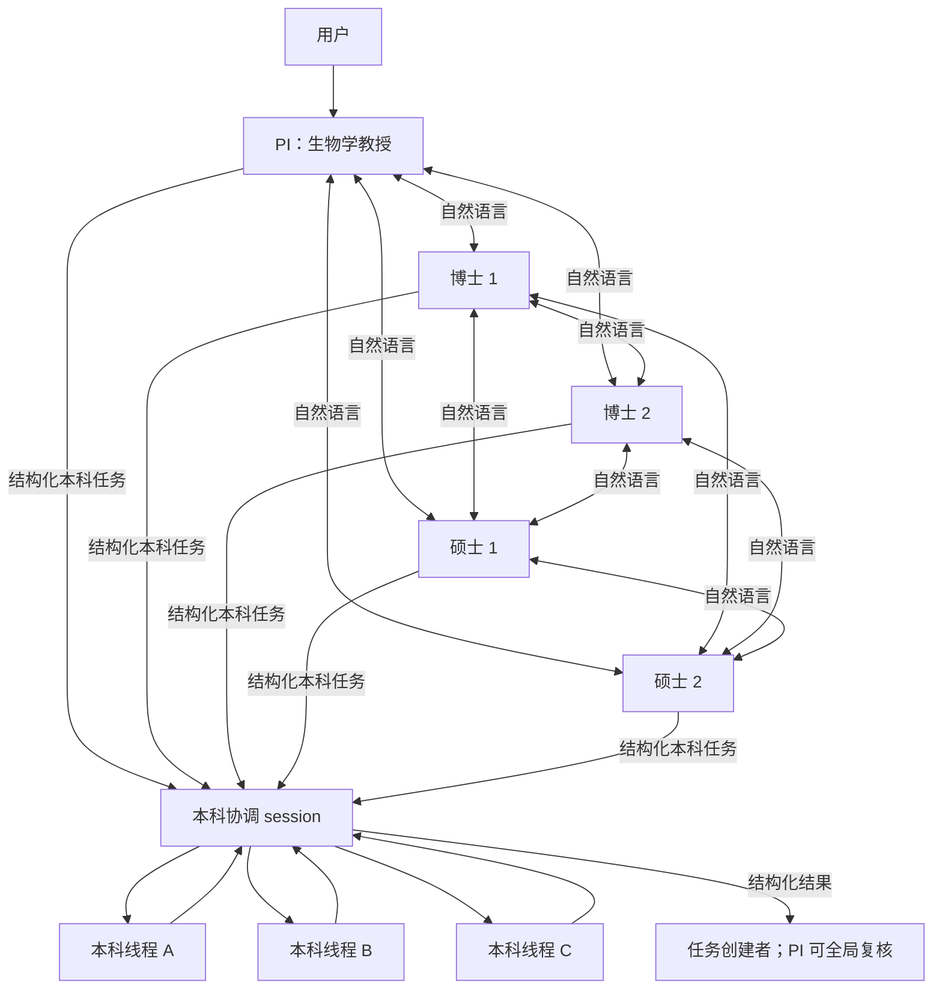
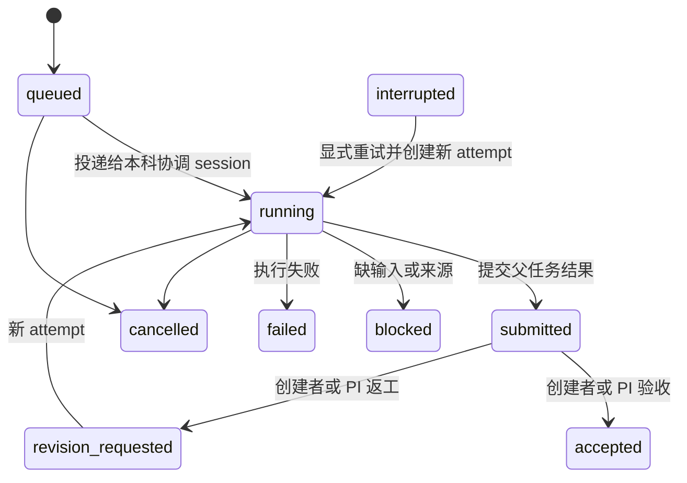

# 02. Virtual Biomed Lab：自然语言协作与本科结构化委派计划

- **状态**：M2 协议与服务端最小闭环已实现；本文保留原始设计、阶段和验收条目作为实施历史。
- **实现前提已满足**：六成员会议、独立 Pi session、3×2 WebUI、会议恢复、PI-only 人工输入，以及服务端固定角色 tool policy 已落地。真实模型/Provider 配置仍须在目标环境单独验收；本文不宣称真实六模型端到端已经通过。
- **目标**：把六个并列窗口升级为一个由“生物学教授”PI 负责、博士和硕士协作、本科承担结构化资料任务的 Virtual Biomed Lab。
- **本计划的核心决策**：PI、博士和硕士之间交换自然语言；PI 必须先通过选项卡向用户澄清并形成 brief，且没有独立文献检索工具；博士 1/2 分别运行“创造性”和“稳健性”两条流水线；硕士负责受托数据分析并返回解读；本科只检索、核验和整理有效文献，不做科学解读；科研执行完全复用现有 Pi/MedPi tools，按角色由服务端 allowlist；组会只新增 `lab_send_message` 和统一的 `lab_orchestrate` 两个 model-visible tools。
- **不包含**：独立 reviewer、第七个常驻成员、从聊天文本自动提取任务、无限递归子智能体、动态换模型或第二套 agent runtime。

## 实现状态与当前边界（2026-08）

以下是当前代码已经提供的 M2 服务端合同；后续章节的“计划/阶段”文字是设计历史，不表示这些边界仍未实现。

- **六角色与真实身份**：PI、博士 1/2、硕士 1/2、本科各绑定一个真实 Pi session。服务端从 `meetingId + sessionId` 推导角色；前端/消息参数声称的角色不被信任。会议创建和冷恢复都会重新应用同一固定 tool policy 与角色 prompt。
- **两条通道**：五位高级成员可用 `lab_send_message` 一对一或一对多交流。正文是审计并投递的数据，`@本科`、JSON、Markdown、XML、取消/完成词都没有控制效果；繁忙收件 session 使用 Pi follow-up 队列。所有状态变化只接受 `lab_orchestrate` 的 typed action。
- **已实现 actions**：`get_state`、澄清卡创建/提交、博士 work package dispatch、本科任务与线程创建/提交/验收、博士 pre-master judgment、硕士 claim/release/analysis、博士 synthesis/review、任务取消和会议完成/取消。每个 mutating action 带 `requestId` 并由 canonical workflow 做幂等和状态校验。
- **角色 tool policy**：PI 没有 `science_search/fetch/inspect/run/kernel`；博士可 fetch/inspect；硕士可 fetch/inspect/run/kernel；本科可 search/fetch 而不能 inspect/run/kernel；所有会议角色禁用 `bash`、`science_stage`、`science_rollback`、`provenance_record` 与 `provenance_review`。高级成员有 `lab_send_message`，本科只有 `lab_orchestrate`。
- **本科边界**：父任务最多 3 条 active child thread、每会最多 6 条；child session 不能再 spawn，且只接收父任务显式 refs。本科结果是 records-only，服务端拒绝 interpretation/conclusion/hypothesis/method。服务端测试已验证文献 scope 默认只接受 PubMed/Crossref、arXiv 必须显式 opt-in，并拒绝其余 5 个数据库；child 使用最小 tool policy，冷恢复仍隔离在同一 policy 与父任务 refs 内。
- **报告与恢复**：PI 只能用 typed `complete_meeting` 写入结构化 `FinalAcademicReport`；七段 workflow 的 durable notice 闭环、消息审计、reservation、父任务和线程状态都持久化并按会议锁恢复。报告固定写入 `.medpi/meetings/<meetingId>/final-report.md`，后端记录其 SHA-256 和 UTF-8 size。重启时无法确认的 child thread 标记为 interrupted，绝不自动重跑。
- **仍有限制**：仅本地、单用户、trusted project 研发基线；没有 reviewer、动态模型回退、无限队列/线程、跨会议记忆或真实模型 E2E 保证。真实 provider 唯一性、thinking 支持、来源访问和完整 UI 交互仍须在部署环境验证。

## 1. 已定语义

### 1.1 六个常驻成员不变

| 角色 | 常驻数量 | 主要责任 | 协作权限 |
|---|---:|---|---|
| PI（生物学教授） | 1 | 思考用户问题、提出澄清、确定 brief、审查证据、综合学术报告、终止会议、向用户交付 | 与博士/硕士自然语言交流；无独立检索/连接器工具；可调用本科做狭义补充检索但不绕过博士流水线；拥有全局取消和最终验收权 |
| 博士 1（creative） | 1 | 拆解问题、文献证据核验、先独立判断，再结合硕士解读，提出创造性结论/假说/实现方法 | 与 PI/另一博士/硕士自然语言交流；通过 `lab_orchestrate(delegate_undergrad)` 委派本科；原子占用空闲硕士 |
| 博士 2（robust） | 1 | 拆解问题、文献证据核验、先独立判断，再结合硕士解读，提出稳健结论/假说/实现方法 | 与 PI/另一博士/硕士自然语言交流；通过 `lab_orchestrate(delegate_undergrad)` 委派本科；原子占用空闲硕士 |
| 硕士 1 | 1 | 接受博士任务、拆解并执行数据分析、阅读文献和数据、返回带方法/不确定性的解读 | 与 PI/博士/另一硕士自然语言交流；不自行升级会议结论；可按既有要求调用本科做资料整理 |
| 硕士 2 | 1 | 接受博士任务、拆解并执行数据分析、阅读文献和数据、返回带方法/不确定性的解读 | 与 PI/博士/另一硕士自然语言交流；不自行升级会议结论；可按既有要求调用本科做资料整理 |
| 本科 | 1 | 接收结构化检索任务、拆成隔离线程、检索/核验/整理有效文献、合并 bibliographic records | 不参加自由自然语言讨论；不得解释、下结论、提假说、提方法；只能在父任务内启动受限子线程 |

本计划中的“所有人都可以调用本科”保留为能力边界，但标准科学路径是博士 1/2 委派本科、硕士按受托任务做分析；PI 的直接调用仅限不改变博士工作包的狭义补充检索，不能用来独立搜索、解释或跳过博士/硕士阶段。用户仍只在 PI pane 输入；博士和硕士的自然语言消息由其 agent 通过会议通信工具发送，不新增五个人工输入框。

### 1.2 PI 保留最终责任，但不是所有通信的中转站

- PI、两位博士和两位硕士可以直接一对一或一对多发送自然语言消息。
- 博士和硕士可以互相追问、挑战结论、请求补充分析，无须每句话经过 PI。
- 自然语言消息只表达观点、问题和建议；它不能直接改变会议、任务或线程状态。
- 只有显式 typed tool/API 调用才能创建本科任务、启动线程、提交结果、验收、返工、取消或结束会议。
- PI 可以查看全部高级成员通信和全部本科任务，且是最终报告的唯一发布者。

### 1.3 PI 澄清门与检索禁区

PI 先思考用户问题，再用选项卡逐题询问缺失信息。澄清未完成时，PI 不能调用文献/数据库检索，也不能向本科或硕士派发科学任务。选项卡是结构化交互，不把用户自然语言猜测成选择：

```ts
interface ClarificationCard {
  questionId: string;
  question: string;
  options: Array<{ id: string; label: string }>;
  allowOther: boolean;
  required: boolean;
}

interface ClarificationResponse {
  questionId: string;
  selectedOptionIds: string[];
  freeText?: string;
}
```

`lab_orchestrate(ask_clarification)` 只允许 PI 创建卡片，`lab_orchestrate(submit_clarification)` 只接受同一 `questionId` 的合法 option ID；重复提交幂等，乱序提交按 questionId 合并。所有必答卡完成后才生成不可变 `ResearchBrief`，然后才能进入博士工作包。卡片的 label、用户自由文本和高级成员消息永远不触发工具、检索、验收或状态变化。

PI 可读取已验收的文献记录、硕士分析和博士 synthesis，并将它们整理为最终学术报告；PI 不持有独立搜索工具。若启用 PI 的补充本科能力，必须显式标记为 `clerical_supplement`，不得产生解释、结论或绕过博士工作包。

## 2. 目标拓扑



本科线程是临时 child `AgentSession`，不算新的实验室成员，也不新增常驻 pane。六位常驻成员仍是会议 roster 的唯一成员。

## 2.1 两条博士流水线与一个受托分析环

PI 形成 `ResearchBrief` 后，同时启动两个相互隔离但证据可交叉核对的 work package。两条流水线共享会议权限和来源约束，不共享未验收的隐式上下文：

1. **博士 1 / creative**：拆解 brief，通过 `lab_orchestrate(delegate_undergrad)` 提交若干文献任务；收到本科仅含 bibliographic records 的结果后核验、去重并形成自己的预分析判断；再通过 `lab_orchestrate(claim_master)` 原子占用一名 `idle` 硕士，以自然语言发送分析请求；读到硕士解释后，提交带有候选新机制、可证伪假说和实现方法的创造性 synthesis，明确区分证据与推断。
2. **博士 2 / robust**：执行同构步骤，但 synthesis 的验收标准是多源一致性、反例、敏感性和不确定性；结论必须保守、可复核，不把单一来源或本科记录直接升级为机制判断。
3. **硕士分析环**：硕士接受博士自然语言请求后自行拆解数据分析，使用现有 sandbox/kernel 产生 artifact，阅读相关文献和数据结果，返回 `AnalysisSubmission`（分析、解释、假设、方法、不确定性和 artifact refs）。硕士不改变博士工作包或会议结论状态。
4. **本科检索环**：本科只检索、核验和整理有效文献记录，可把同一个父任务拆成受限并行线程；不写解释、结论、假说、方法，不做数据分析。线程结果先回本科协调 session，再由它提交一次父任务结果。

博士的“先独立判断、再结合硕士解读”由 typed 阶段门保证，而不是依赖 prompt 自觉：必须先提交 `pre_master_judgment`，才可进入 `master_requested`；只有硕士提交后才可提交 `doctor_synthesis`。阶段正文仍是自然语言，服务端只校验阶段信封和证据引用。

## 2.2 自然语言正文与结构化控制分离

PI、博士和硕士之间的消息正文保持自然语言，允许讨论、质疑和解释；正文中的 JSON、Markdown、XML、`@本科`、“已完成”或“已验收”永远只是数据。结构化 API/tool 只负责澄清卡片、文献任务、阶段门、硕士资源 reservation、提交、验收、返工、取消和恢复。不得用 regex 或 prompt 解析自然语言来驱动状态机。

## 3. 两条严格分离的通信通道

### 3.1 高级成员自然语言通道

高级成员使用 `lab_send_message` 发送普通自然语言。传输层只需要最小路由信封：

```ts
interface LabMessage {
  messageId: string;
  meetingId: string;
  fromRole: "pi" | "phd-1" | "phd-2" | "master-1" | "master-2";
  toRoles: Array<"pi" | "phd-1" | "phd-2" | "master-1" | "master-2">;
  body: string;
  replyTo?: string;
  createdAt: string;
}
```

边界：

- `body` 是自然语言数据，不解析其中的 `@本科`、JSON、Markdown、XML、命令或状态词。
- 一条消息不能发送给自己；收件人必须是同一会议的高级成员；收件人去重并设置小型固定上限。
- 发送消息是显式 agent tool call；收到消息不会自动广播或自动回复。
- 服务端先持久化路由记录，再把带有明确发送者标签的消息投递到目标 Pi session。
- 会话历史仍由各 Pi session 保存；会议通信记录只保存路由和审计所需内容，不复制模型推理状态。
- 普通自然语言中的“已完成”“取消”“请本科查一下”都没有控制效果。

### 3.2 本科结构化任务通道

博士 1/2 的科学检索只能通过 `lab_orchestrate(delegate_undergrad)` 创建本科任务；PI 的可选调用必须声明 `clerical_supplement`，硕士只能按既有职责做资料整理。禁止从聊天文本自动转换任务，也禁止把整段高级成员聊天历史隐式交给本科。

最小父任务合同：

```ts
type UndergradWorkType =
  | "literature_search"
  | "literature_validate"
  | "literature_extract";

interface UndergradTask {
  taskId: string;
  meetingId: string;
  requesterRole: "pi" | "phd-1" | "phd-2" | "master-1" | "master-2";
  requesterSessionId: string;
  doctorWorkPackageId?: string;
  purpose?: "scientific_retrieval" | "clerical_supplement";
  workType: UndergradWorkType;
  title: string;
  objective: string;
  instructions: string[];
  inputRefs: string[];
  acceptanceCriteria: string[];
  maxThreads: number;
  status:
    | "queued"
    | "running"
    | "submitted"
    | "accepted"
    | "revision_requested"
    | "blocked"
    | "failed"
    | "cancelled"
    | "interrupted";
  attempt: number;
  createdAt: string;
  updatedAt: string;
}
```

合同约束：

- `inputRefs` 只能引用明确的 artifact、文件或会议消息 ID；不默认共享其他 pane 的上下文。
- `acceptanceCriteria` 必须至少一项；文献检索任务还必须给出来源定位、有效性和去重要求。
- `workType` 只能是检索、来源核验或元数据摘录；本科任务不得要求数据分析或科学解释。
- `maxThreads` 只能为 1–3，且仍受全会议 active thread 上限约束。
- 文本、数组数量、单项长度、引用数量和结果大小都要有服务端上限。
- 创建者默认是验收人；PI 可查看、取消、返工或覆盖验收任何本科任务。
- 博士或硕士不能仅凭自然语言宣告任务完成；必须调用 typed review action。

## 4. 本科多线程模型

### 4.1 父任务与 child thread

本科常驻 session 是协调者。它收到父任务后，可以调用 `lab_orchestrate(spawn_undergrad_threads)` 创建一个或多个 child thread：

```ts
interface UndergradThreadSpec {
  threadId: string;
  meetingId: string;
  parentTaskId: string;
  attempt: number;
  title: string;
  objective: string;
  inputRefs: string[];
  acceptanceCriteria: string[];
}
```

示例：父任务“整理 EGFR 耐药机制文献”可拆为：

- 线程 A：检索 2023–2026 年综述和指南；
- 线程 B：整理临床耐药突变；
- 线程 C：整理旁路激活和组织学转化；
- 本科协调 session 最后去重并合成一个父任务提交。

### 4.2 并发和递归硬边界

M2 默认：

- 每个父任务最多 **3 条 active child threads**；
- 每个会议最多 **6 条 active undergraduate threads**；
- child thread 的 action allowlist 不包含 `spawn_undergrad_threads`，因此不存在孙线程；
- 每条 thread 使用独立 Pi child session、独立上下文和独立输出目录；
- thread 只收到父任务显式分配的 `inputRefs`，不能读取其他本科任务的隐式上下文；
- 达到容量时返回明确 `undergrad_capacity_exceeded`，不静默排队、不后台重试、不自动扩容；
- 重试创建新的 `attempt`，保留旧 attempt 的结果和诊断，不复用失败线程冒充成功。

这些上限是首期产品常量，用来实现可测的多线程而非无限扩张；未来只有真实负载证据出现后才考虑配置化。

### 4.3 线程结果与父任务提交

每条 child thread 必须结构化返回有效文献记录，不得返回科学解释：

```ts
interface UndergradThreadResult {
  threadId: string;
  parentTaskId: string;
  status: "submitted" | "blocked" | "failed" | "cancelled";
  summary: string;
  records: Array<{
    title: string;
    authors: string[];
    year?: number;
    doi?: string;
    pmid?: string;
    url?: string;
    source: string;
    retrievedAt: string;
    quoteOrMetadata: string;
  }>;
  artifactRefs: string[];
  limitations: string[];
  blockedReason?: string;
}
```

本科协调 session 合并 child results，并通过 `lab_orchestrate(submit_undergrad_records)` 只提交一份父任务结果：

```ts
interface UndergradTaskSubmission {
  taskId: string;
  status: "submitted" | "blocked" | "failed";
  summary: string;
  records: Array<{
    title: string;
    authors: string[];
    year?: number;
    doi?: string;
    pmid?: string;
    url?: string;
    source: string;
    retrievedAt: string;
    quoteOrMetadata: string;
  }>;
  artifactRefs: string[];
  limitations: string[];
  threadIds: string[];
  blockedReason?: string;
}
```

`records` 的去重 key 按 DOI、PMID、URL 优先，服务端拒绝非空的 `interpretation`、`conclusion`、`hypothesis`、`method` 字段；本科不能返回 claims、机制判断或数据分析。线程输出不能直接成为高级成员可引用的最终结论；只有父任务提交被创建者或 PI 验收后，才能进入博士工作包和 PI 最终报告的证据集合。

### 4.4 硕士空闲槽位与博士 synthesis 合同

博士请求硕士时先调用 `lab_orchestrate(claim_master)`，以 `meetingId + doctorWorkPackageId + requestId` 幂等地原子占用一名 `idle` 硕士。占用成功后才发送自然语言正文；发送失败必须通过 `lab_orchestrate(release_master)` 释放 reservation。没有空闲硕士时返回 `awaiting_master`/`master_capacity_exceeded`，不隐式排队、不双占。自然语言正文不是状态转换依据。

```ts
interface MasterAnalysisRequestMeta {
  requestId: string;
  meetingId: string;
  doctorWorkPackageId: string;
  masterSessionId: string;
  inputRefs: string[];
  expectedOutput: string;
}

interface AnalysisSubmission {
  requestId: string;
  analysis: string;
  interpretation: string;
  assumptions: string[];
  methodsUsed: string[];
  uncertainty: string[];
  artifactRefs: string[];
}

interface DoctorSynthesisSubmission {
  workPackageId: string;
  mode: "creative" | "robust";
  ownReasoning: string;
  masterInterpretations: string[];
  evidenceRefs: string[];
  conclusion: string;
  hypotheses: string[];
  proposedMethods: string[];
  limitations: string[];
  unansweredQuestions: string[];
}
```

`ownReasoning` 必须在 `master_requested` 前以 `pre_master_judgment` checkpoint 持久化。`creative` 要求候选新机制和可证伪假说并标注推断；`robust` 要求多源一致性、反例、敏感性和保守边界。博士必须先有本科 `accepted` 记录、再有 `AnalysisSubmission`，才允许提交 synthesis；PI 只能验收带 evidence refs 的 synthesis。

## 5. 权限矩阵

| 动作 | PI | 博士/硕士 | 本科协调 session | 本科 child thread |
|---|---:|---:|---:|---:|
| 向高级成员发送自然语言 | 是 | 是 | 否 | 否 |
| 创建本科文献任务 | 仅 `clerical_supplement` | 博士科学检索；硕士按受托资料整理 | 否 | 否 |
| 查看自己创建的本科任务 | 是 | 是 | 当前分配 | 当前线程 |
| 查看全部本科任务 | 是 | 否 | 是 | 否 |
| 启动本科 child threads | 否 | 否 | 是 | 否 |
| 提交 thread result | 否 | 否 | 否 | 是 |
| 提交父任务结果 | 否 | 否 | 是 | 否 |
| 验收/返工本科父任务 | 全部 | 仅自己创建 | 否 | 否 |
| 取消本科父任务 | 全部 | 仅自己创建 | 可报告阻塞 | 否 |
| 完成或取消整个会议 | 是 | 否 | 否 | 否 |
| 创建/提交 PI 澄清卡片 | 是 | 否 | 否 | 否 |
| 占用空闲硕士槽位 | 否 | 博士可占用 | 否 | 否 |
| 提交博士 pre-judgment/synthesis | 否 | 对应博士 work package | 否 | 否 |

所有权限由服务端根据真实 `meetingId + sessionId + role` 校验，不能相信前端 role，也不能仅依赖 system prompt。

### 5.1 复用现有 tools，不复制科研能力

当前 MedPi 除 Pi 内置的 `read / bash / edit / write / grep / find / ls` 外，只在 `packages/science/extensions/index.ts` 注册了 11 个科研 tools。M2 不新增文献、文件、Python/R 或 provenance 工具，先把这 11 个工具收敛为“模型可见核心能力”和“内部服务/UI 动作”：

| 现有 tool | M2 必要性 | 决策 |
|---|---|---|
| `read` | 必需 | 所有角色读取明确授权的文献、数据和产物 |
| `write` / `edit` | 条件必需 | PI 写报告、硕士写分析产物；本科不自由写项目文件 |
| `bash` | 组会禁用 | 会绕过 `science_run` 的 permission、审计、checkpoint、abort 和 provenance；不作为科研执行或 workflow 修改入口 |
| `grep` / `find` / `ls` | 辅助 | 可按角色开放项目导航，但不是 M2 验收条件 |
| `science_list_dbs` | 低，内部化 | 8 个数据库已经是 `science_search` schema 的枚举；改成 UI/资源说明或搜索工具描述，不再占 model-visible tool |
| `science_search` | 高，核心保留 | MedPi 的科研发现能力；组会仅本科可用，并由任务限制来源范围 |
| `science_fetch` | 高，核心保留 | 搜索结果只是线索，必须 fetch DOI/PMID/accession 等可核验记录；博士/硕士也可读取指定记录 |
| `science_inspect` | 高，核心保留 | Pi `read` 不能替代格式识别、magic bytes、gzip 上限和二进制降级；博士/硕士可用 |
| `science_kernel` | 中至高，核心保留 | 硕士的持久 Python/R 数据分析闭环需要；PI、本科禁用 |
| `science_run` | 中至高，核心保留 | 与 Pi `bash` 有执行重叠，但保留可审计计算、日志、provenance、abort 和 checkpoint 的产品承诺；组会只给硕士 |
| `science_rollback` | 不再模型可见 | 当前接受任意 SHA 且会 `git add -A`/commit/`reset --hard`；重构为绑定具体 run checkpoint 的人工结果卡动作 |
| `science_stage` | 会议状态禁用 | 可用于单 session 内部研究提示，但不能记录 meeting、work package、任务或 reservation 状态，避免第二事实来源 |
| `provenance_record` | 内部化 | 当前只记录模型声明的 label/path/meta，不能保证内容 lineage；改由 search/fetch/run/kernel 和 artifact backend 自动写入 |
| `provenance_query` | 高，核心保留 | 只读查询证据 DAG，供博士和 PI 验证来源、运行与产物 |
| `provenance_review` | 暂缓 | M2 没有独立 reviewer，且当前 writer 固定为 `pi-science-reviewer`；在 PI/reviewer 权限协议确定前不向组会角色开放 |

最终 model-visible 科研核心收敛为：

```text
science_search
science_fetch
science_inspect
science_run
science_kernel
provenance_query
```

`science_search → science_fetch` 必须自动写 source 节点；`science_run/science_kernel` 自动写 run 节点；生成 artifact 时由后端读取内容并计算 SHA-256、size 和受控 path。模型不手填 content hash，也不靠 `provenance_record` 声明真实性。`science_run` 与 `science_kernel` 分别承担一次性命令和有状态 Python/R，不能互相冒充。workflow 服务只保存 artifact/provenance refs，不复制科研结果正文。

`science_rollback` 的替代路径只出现在具体 `science_run` 结果卡上：服务端从 run record 读取该次运行创建并持久化关联的 checkpoint，不接受模型或浏览器提交任意 SHA；执行前展示受影响文件并要求用户确认。回滚实现不得重新扩大成通用 model tool。

### 5.2 工具激活是 M2 的前置阻塞项

当前 `withExtensionTools()` 在 preset 不是 `off` 时把全部非 Pi 内置工具加入 session；组会创建成员时又没有传 `toolNames`。因此现状只有“全部关闭”或“11 个 extension tools 全部开放”，会让 PI 搜索、本科运行 kernel、任何成员 rollback 或写 reviewer finding。

在实现 agent-to-agent 编排前，先完成一个独立前置补丁：

1. 扩展 session 创建合同，使普通会话保持现有 preset 行为，组会会话必须显式传入 `toolNames`；
2. `withExtensionTools()` 对显式 `toolNames` 做精确交集，不再因 preset 开启而追加全部 extension tools；
3. `group-meeting-server` 根据固定 roster 计算角色 allowlist，并在创建和恢复 session 时使用同一列表；
4. 未列出的 extension tool 不注册到该 session；服务端同时校验 `lab_orchestrate` action，不能只靠隐藏 UI 或 prompt；
5. session JSONL/meeting metadata 只保存可重建的角色和 tool policy version，不复制一份会漂移的工具事实来源。

普通单智能体会话可以继续使用完整科研 preset，但 `science_rollback`、内部化的 `provenance_record` 和暂缓的 `provenance_review` 必须从通用 model-visible 集合单独移除或显式受控，不能因兼容普通会话而继续无条件暴露。

### 5.3 服务端角色 tool allowlist

工具权限必须在每个真实 Pi session 创建/恢复时由服务端计算并执行，WebUI 隐藏和 system prompt 只用于说明，不是权限边界。

| Tool | PI | 博士 1/2 | 硕士 1/2 | 本科协调/child |
|---|---:|---:|---:|---:|
| `read` | 是 | 是 | 是 | 是 |
| `write` / `edit` | 最终报告 | synthesis 产物可选 | 分析脚本/产物 | 否 |
| `bash` | 否 | 否 | 否 | 否 |
| `grep` / `find` / `ls` | 可选 | 可选 | 可选 | 可选 |
| `science_search` | 否 | 否 | 否 | 是，受任务 DB scope 限制 |
| `science_fetch` | 否 | 是 | 是 | 是 |
| `science_inspect` | 否 | 是 | 是 | 否 |
| `science_run` / `science_kernel` | 否 | 否 | 是 | 否 |
| `science_list_dbs` / `science_rollback` / `provenance_record` | 否，内部/UI | 否，内部/UI | 否，内部/UI | 否，内部/UI |
| `science_stage` / `provenance_review` | 否 | 否 | 否 | 否 |
| `provenance_query` | 是 | 是 | 是 | 可选 |
| `lab_send_message` | 是 | 是 | 是 | 否 |
| `lab_orchestrate` | PI actions | doctor actions | master actions | undergrad actions |

`lab_orchestrate` 虽是一个 model-visible tool，但 action allowlist 仍按角色校验；拥有该 tool 不代表拥有全部 action。PI 不得通过补充本科任务或其他 action 获得 `science_search`/`science_fetch`，本科不得借提交 payload 写入解释、结论、假说或方法。

本科的 `delegate_undergrad` 任务必须携带允许的数据库 scope。默认只允许 `pubmed` 和 `crossref`；只有任务显式允许 preprint 时才加入 `arxiv`。`pubchem`、`ensembl`、`uniprot`、`reactome`、`geo` 是科学数据源，不得被“有效文献检索”任务自动启用；未来如需访问，必须使用不同 work type 和明确 acceptance criteria。

## 6. 状态与状态转移

### 6.1 会议

沿用 M1 的 `creating | ready | failed`；编排启用后增加用户澄清和报告阶段：

```text
ready → clarifying → awaiting_user_input → brief_ready → running → pi_review → completed
                                                                    ↘ cancelled
```

高级成员的普通对话不单独制造 workflow 状态；只有 typed 阶段门改变 canonical 状态。刷新不会重跑已有阶段。

### 6.2 博士 work package 与硕士请求

```text
draft → retrieval_dispatched → retrieval_submitted → retrieval_accepted
      → pre_master_judgment → master_reserved → master_requested
      → master_submitted → doctor_synthesized → pi_review
      → accepted | revision_requested
```

硕士请求单独记录：

```text
idle → reserved → requested → running → submitted → released
                     ↘ send_failed → released
```

自然语言消息不会把硕士从 `idle` 变成 `requested`；只有 reservation/assignment typed action 才能转换。博士未完成本科验收或自己的 pre-judgment 时不能请求硕士或提交 synthesis。

### 6.3 本科父任务



### 6.4 本科线程

```text
created → running → submitted | blocked | failed | cancelled | interrupted
```

所有状态变化只通过 typed action。聊天完成、SSE idle、模型停止输出或页面关闭都不代表任务 `accepted`。

## 7. 消息投递与运行边界

- 复用现有六个 `AgentSession`、`AgentSessionWrapper.send()`、follow-up/steer、SSE、abort 和 session JSONL；不建立第二套模型连接。
- 高级成员消息由会议服务写入一次 canonical route record，再以带发送者/meeting/message ID 的自定义或受控 prompt 投递给收件 session。
- 收件 agent 可以自然语言回答，也可以继续显式调用 `lab_send_message`；服务端不自动生成回信。
- 本科父任务和 child thread 都通过 typed tool/API 投递，禁止使用自由文本 prompt 伪造任务状态。
- 任一 session 忙碌时，沿用 Pi 的 follow-up 队列语义；不并发写同一个 session，也不新增后台 scheduler。
- 每次投递使用稳定幂等键：高级消息为 `meetingId:messageId:recipientRole`；本科任务为 `meetingId:taskId:attempt`；线程为 `meetingId:taskId:attempt:threadId`。
- 重复 API、双击或重连只能返回原投递结果，不能启动第二次模型调用。

## 8. 持久化、产物与 provenance

### 8.1 一份编排状态来源

在现有项目隔离的 meeting metadata 旁新增一份原子写入的 workflow 记录，或在不破坏 M1 合同的前提下扩展同一记录。实现时只选择一种，不双写：

```text
~/.pi/agent/meetings/<project-key>/<meetingId>.workflow.json
```

该记录保存：

- 高级成员消息路由及投递状态；
- 本科父任务、attempt、状态、创建者和验收人；
- child thread ID、child session ID、状态和父任务关系；
- 提交、验收、返工、取消和恢复决策；
- artifact/provenance 引用，不保存大文件正文。

因为五位高级成员和多条本科线程可能同时提交，写入必须经过 meeting-scoped lock，并继续使用现有原子替换方式。不能使用读取—修改—写入而无并发保护。

### 8.2 运行产物

```text
.medpi/meetings/<meetingId>/
  tasks/<taskId>/
    attempt-1/
      threads/<threadId>/
      submission.json
    attempt-2/
  final-report.md
```

- 代码执行继续走现有 `science_run` / `science_kernel` 和 provenance 边界；六个组会角色不使用 Pi `bash` 执行科研计算。
- 文献、数据库、文件和代码结果都必须留下可定位来源或 artifact 引用；source/run 节点由执行工具自动写入，artifact hash/size/path 由后端从真实内容计算。
- workflow 不提供通用 rollback action；只有具体 `science_run` 结果卡可以请求用户确认后回滚到该 run 绑定的 checkpoint。
- child thread 只能写自己的隔离目录；本科协调 session 只能合并同一父任务的线程产物。
- 会议通信正文不当作事实来源；PI 最终报告只能引用已验收父任务或其他有 provenance 的高级成员产物。
- 凭据、session 文件、runtime data 和生成产物不得提交 Git。

## 9. 服务端工具和 API 计划

### 9.1 只新增两个 model-visible tools

现有 Pi/MedPi tools 负责文件、文献、分析和 provenance；M2 只新增：

```text
lab_send_message   # PI/博士/硕士之间的自然语言路由
lab_orchestrate    # 所有结构化控制动作
```

`lab_send_message` 只接受 `meetingId`、收件角色、自然语言正文和可选 `replyTo`。它不解析正文，也不能改变任务状态。

`lab_orchestrate` 使用单一 discriminated union，不为每个动作注册独立 tool：

```ts
type LabOrchestrateAction =
  | "get_state"
  | "ask_clarification"
  | "submit_clarification"
  | "dispatch_doctor"
  | "delegate_undergrad"
  | "spawn_undergrad_threads"
  | "submit_undergrad_thread"
  | "submit_undergrad_records"
  | "review_undergrad_records"
  | "claim_master"
  | "release_master"
  | "submit_pre_master_judgment"
  | "submit_master_analysis"
  | "submit_doctor_synthesis"
  | "request_revision"
  | "report_blocked"
  | "cancel_task"
  | "complete_meeting"
  | "cancel_meeting";
```

服务端根据真实 session role 对 action 做白名单校验，并按 action 校验不同 payload schema；不接受一个宽泛的可选字段对象。`get_state` 只返回调用者有权看到的 canonical workflow 摘要。PI、博士、硕士、本科协调 session 和本科 child 共享同一内部 workflow service，但拥有不同 action 集合。

这两个工具沿用现有 Pi extension 注册点和真实 session context；不通过浏览器伪造 tool result，不在 `packages/science` 塞入非科学域的 Web 编排状态，也不新增独立 runtime。旧草案中的 `undergrad_retrieve`、`lab_claim_master_slot`、`doctor_checkpoint`、`undergrad_submit_task` 等名称仅作为 action 语义保留，不再分别实现。

### 9.2 Web API

建议在现有 meeting 资源下增加：

```text
GET  /api/meetings/[id]/workflow?cwd=...
POST /api/meetings/[id]/messages
POST /api/meetings/[id]/clarifications
POST /api/meetings/[id]/clarifications/[questionId]/responses
POST /api/meetings/[id]/undergrad-tasks
POST /api/meetings/[id]/undergrad-tasks/[taskId]/actions
POST /api/meetings/[id]/masters/reservations
POST /api/meetings/[id]/work-packages/[workPackageId]/actions
```

工具层与 WebUI 必须调用同一组内部服务函数，而不是通过本机 HTTP 互调或复制权限/状态逻辑。所有请求继续校验 origin/host、trusted cwd、allowed root、meeting UUID、成员 session 和 JSON content type。

## 10. WebUI 计划

保留现有 3×2 六 pane 和 PI-only 用户输入，不建立第二套聊天页面。

### PI pane

- 在首次输入后显示澄清选项卡；逐题记录选择、自由文本和完成状态，未完成必答项时禁用博士 dispatch。
- 不显示文献搜索/数据库工具按钮；PI 只能查看已验收证据、博士 synthesis、硕士分析和 provenance。
- 最终报告卡片要求列出 brief、来源、creative/robust 两条路线、冲突与限制、结论/假说/实现方法及待确认问题。

### 高级成员 pane

- 消息流中明确显示“来自 PI / 博士 / 硕士”的自然语言消息；
- 显示回复关系和投递状态，但正文按普通不可信文本渲染；
- agent 可使用工具与其他高级成员对话，用户不能直接在博士/硕士 pane 输入；
- 自然语言消息不得渲染成可执行的任务、取消或验收按钮。
- 博士 pane 显示自己的 `creative`/`robust` 模式、pre-judgment、硕士 reservation 和 synthesis 阶段；硕士 pane 显示受托请求、分析运行、解释和释放状态。
- `science_run` 结果卡可显示“回滚本次运行”，但必须先列出该 run checkpoint 将影响的文件并由用户确认；不提供 SHA 输入框，也不把回滚暴露为模型 tool。

### 本科 pane

- 从普通空聊天窗升级为本科任务面板与协调 session 流；
- 显示父任务创建者、类型、状态、attempt、验收条件；
- 文献任务只显示检索范围、来源有效性、去重 key 和 bibliographic records；不显示或生成解释、结论、假说、方法字段；
- 显示当前线程数量和 `active / 3`、全会议 `active / 6` 容量；
- 每条线程显示标题、状态、来源/产物和错误；
- 父任务提交、返工和验收以结构化卡片展示；
- 点击线程可查看对应 child session 历史，但不把 child session 加入左侧常驻成员列表。

### 会议顶部

显示派生摘要：

```text
自然语言协作中 · 本科 4 条线程运行 · 2 个父任务待验收 · 1 个阻塞
```

PI 可查看全部任务并执行全局取消或结束会议；其他高级成员只操作自己创建的本科任务。

## 11. 取消、失败与恢复

- 单条自然语言消息投递失败只标记该收件人失败，不重放给其他人、不切换模型。
- 本科 child thread 失败只影响对应线程；本科协调 session 可在容量内开替代线程，或提交带局限的结果。
- 取消父任务必须 abort 其全部 active child sessions，保留已生成 artifact、线程结果和取消原因。
- PI 取消会议必须停止尚未完成的本科父任务/线程，并沿用现有 session abort；不删除六位成员和 child session 历史。
- 刷新通过 `meetingId + cwd` 恢复 workflow 和所有 session 引用，绝不重新创建已经存在的线程。
- 若记录为 active 的 child session 在重启后不能确认仍在运行，则标记 `interrupted`；只有任务创建者或 PI 显式 retry 才创建新 attempt。
- 不自动重试、不自动换成员、不自动更换 provider/model/thinking level。
- 高级成员的观点冲突由 PI 在自然语言中处理；不能用多数投票把无来源观点变成事实。

## 12. 分阶段补丁

### 阶段 0：角色 tool allowlist 与高风险工具收敛

这是 M2 编排代码的阻塞前置，不与消息路由或状态机混在同一补丁。

产物：session 创建的显式 `toolNames` 合同、`withExtensionTools()` 精确交集、固定 roster→tool allowlist、创建/恢复一致性；`science_list_dbs` 移入 UI/schema 说明，`provenance_record` 改为 search/fetch/run/kernel/artifact backend 自动写入，`science_rollback` 改为 run 结果卡人工确认动作，组会禁用 `science_stage`/`provenance_review`。

同补丁测试：

- 普通单智能体 preset 保持已定义行为，显式 `toolNames` 不会被追加其他 extension tools；
- PI 不可见/不可调用 search、run、kernel，博士不可见 search，硕士不可见 search，本科不可见 inspect/run/kernel；
- 创建和恢复后的同一角色得到相同 tool allowlist；伪造前端 role、toolName 或 action 被服务端拒绝；
- 本科默认 search scope 只有 PubMed/Crossref，arXiv 需任务 opt-in，其他五个科学数据源不因文献任务启用；
- search/fetch 自动生成可查询 source provenance，run/kernel 自动生成 run provenance，artifact 的 SHA-256/size/path 来自后端内容；
- 模型无法提交任意 rollback SHA；只有具体 run 的结果卡、用户确认和该 run 关联 checkpoint 能执行回滚；
- 组会 session 中 `science_stage`/`provenance_review` 不注册，六个角色均不注册 `bash`。

### 阶段 A：合同、权限和持久化

产物：共享 types、workflow 原子持久化、meeting lock、角色鉴权、角色 tool/action allowlist、`lab_orchestrate` discriminated union、本科父任务/线程合同和状态转移。

同补丁测试：

- PI 在必答澄清完成前不能检索、派发或生成 brief；卡片选项提交可乱序且重复幂等；
- 自然语言中的 `@本科`、伪造 JSON、XML 或“取消任务”不创建/改变任何任务；
- 博士 1/2 能通过 `lab_orchestrate(delegate_undergrad)` 创建各自 work package 的合法检索任务；PI 的调用只能标记 `clerical_supplement`；本科、外部 session、其他会议和其他项目被拒绝；
- 创建者只能验收/取消自己的任务，PI 可操作全部；
- 非法状态转移、超长字段、跨会议 artifact refs 和伪造 role 被拒绝；
- 本科 submission 含 `interpretation`、`conclusion`、`hypothesis` 或 `method` 时拒绝；
- 每个角色只看到允许的 Pi/MedPi tools；即使伪造 tool/action 参数也无法越权；六个会议角色均不能调用 `bash`；
- `science_stage` 不能改变 meeting/work-package/task/reservation canonical 状态；
- 并发写入不丢消息、不覆盖本科任务，重复请求保持幂等。

### 阶段 B：高级成员自然语言通信

产物：`lab_send_message`、同一内部投递服务、收件 session follow-up/steer、路由审计和 pane 内发送者展示。

同补丁测试：

- 一对一和一对多正确投递，发送者/收件人/session 归属准确；
- 高级成员可互相自然语言回复，但消息不自动广播、不自动创建本科任务；
- 伪造“检索完成/已验收/已取消”的自然语言不改变任何状态；
- busy session 沿用 Pi follow-up，不发生同 session 并发写；
- 双击/重连不重复投递；单一收件人失败有局部诊断；
- 普通 M1 PI 输入、SSE、历史恢复和文件授权无回归。

### 阶段 C：本科父任务和多线程

产物：`lab_orchestrate` 的本科、硕士和博士 actions，child session 创建/隔离、线程提交、父任务合并、取消和恢复；科研执行继续调用现有 science/provenance tools。

同补丁测试：

- 博士 1/2 的 work package 必须先接收本科 `accepted` 记录，再提交 pre-judgment、占用空闲硕士并请求分析；
- 博士 1 的 `creative` 与博士 2 的 `robust` 模式、输入、证据和 synthesis 不串线；
- 一个文献父任务可同时启动 3 条不同线程并合成一份只含 bibliographic records 的提交；
- 第 4 条同父任务线程、全会议第 7 条 active 线程返回明确容量错误；
- child thread 不能再 spawn，不能读取其他父任务输入或写其他任务目录；
- PI/博士/硕士的合法调用范围分别受 `clerical_supplement`、科学检索和受托资料整理约束；结果只回创建者且 PI 可查看；
- 两个博士并发 claim 同一空闲硕士时只有一个成功；发送失败释放 reservation；无空闲硕士返回显式容量状态；
- 博士没有硕士 `AnalysisSubmission` 或 evidence refs 时不能 synthesis；
- 父任务取消级联 abort active child sessions，但保留产物；
- registry/页面恢复不重建线程；不可恢复线程转 `interrupted`，显式 retry 使用新 attempt；
- 未验收 thread 或父任务结果不能进入最终报告引用集合。

### 阶段 D：WebUI 与端到端闭环

产物：高级成员消息标签、本科任务/线程面板、会议摘要、PI 终审和恢复 UI。

端到端场景：

1. 用户向 PI 提出一个生物医学问题；
2. PI 通过选项卡追问范围、时间窗、疾病/机制和期望产出，等待用户逐题确认；
3. PI 生成 brief，启动博士 1 creative 与博士 2 robust 两个 work package；
4. 两位博士各自拆解并派发本科文献检索，本科将任务拆为最多 3 条线程并只返回有效 bibliographic records；
5. 博士核验/去重记录，先提交自己的 pre-judgment，再分别原子占用空闲硕士并发送自然语言分析请求；
6. 硕士拆解并执行数据分析，返回带方法、假设、不确定性和 artifacts 的解读；
7. 博士结合硕士结果提交 creative/robust synthesis，PI 审查证据、冲突和限制并生成学术报告；
8. 返工、取消或刷新后恢复相同消息、父任务、线程和 session IDs，任何 interrupted 项都不自动重跑。

验证运行既有 `npm test`、typecheck、lint、`git diff --check`；开发期间不运行 `next build`。

## 13. M2 首个可用闭环

首个可用版本必须同时做到：

- 组会 session 创建/恢复执行服务端角色 tool allowlist，不能继承“全部 extension tools”；
- model-visible 科研核心只有按角色开放的 `science_search`、`science_fetch`、`science_inspect`、`science_run`、`science_kernel`、`provenance_query`；其余工具按计划内部化、禁用或暂缓；
- 五位高级成员可互相自然语言通信；
- PI 澄清卡片、用户逐题确认和 brief gate 可恢复；
- 博士 1 creative 与博士 2 robust 两条顺序正确的工作包可运行；
- 博士能结构化委派本科检索、原子占用空闲硕士，并先判断后综合；
- 硕士能执行受托分析并返回带解释的结构化提交；
- 本科只能返回可去重的有效文献记录，不能返回解释/结论/假说/方法；
- 本科能为一个父任务启动至少两条、最多三条并行 child threads；
- 线程隔离、结果合并、创建者/PI 验收、取消和刷新恢复可用；
- 普通自然语言永远不能伪造控制操作；
- 六位常驻成员、现有 Pi session/SSE、science sandbox/kernel/provenance 边界保持不变。
- model-visible 编排能力只新增 `lab_send_message` 和 `lab_orchestrate`；所有科研能力复用现有 Pi/MedPi tools，并由服务端角色 allowlist 限制。

只做消息转发而没有本科结构化闭环，或只做任务卡而没有真实 child session 并行，都不能宣称 M2 完成。

## 14. 明确非目标

- 不从自然语言自动识别或生成本科任务；
- 不为每个编排 action 注册一个独立 tool，不复制现有文献、Python/R、文件或 provenance 能力；
- 不使用 `bash`、自由 `write/edit` 或 `science_stage` 修改 canonical meeting workflow；
- 不把 `science_rollback` 作为通用模型工具，不接受任意 SHA，不让模型手填 `provenance_record` 代替后端内容校验；
- 不允许 PI 独立检索文献、把未验收观点直接写成报告，或跳过博士/硕士工作包；
- 不允许本科进行数据分析、文献解释、结论/假说/实现方法生成；
- 不允许博士在读取硕士结果前提交 synthesis，也不允许硕士自行升级会议结论；
- 不让本科参加高级成员自由讨论；
- 不让 child thread 创建孙线程或新的高级成员；
- 不做无限线程、后台队列、后台轮询、自动扩缩容或自动模型回退；
- 不共享全部 session 历史，不把一个学生的隐式上下文复制给另一个学生；
- 不加入 reviewer、投票系统、跨会议长期记忆、Research Graph/GEPA 或 MCP sidecar；
- 不把自然语言通信当作证据或事实；
- 不绕过现有 permission owner、science sandbox、abort、audit、rollback 和 provenance。

## 15. 与 M1 的关系和实施前置

- 本文是 `01-group-meeting-multi-agent.md` 中“M2 PI→成员协议”的具体化；只有 M2 代码落地后，才能移除 AGENTS 中“禁止 agent-to-agent scheduling”的临时 guardrail。
- M1 的严格模型解析继续生效。当前真实 ModelsConfig 的 `gpt-5.6-sol` provider 歧义、缺少 `deepseek-v4-pro`、`gpt-5.6-terra/xhigh` 不支持等问题仍需先解决，才能进行六位常驻成员的真实端到端验收。
- M2 的真实端到端验收还必须验证澄清卡片 gate、两种博士模式、空闲硕士 reservation、阶段顺序和本科 records-only schema；不能用 prompt 文本或 fixture 冒充这些控制边界。
- 实施中不得通过修改 roster、别名模型、静默降级或测试 fixture 掩盖这些配置问题。

## 16. 参考

- 本仓库：`docs/plan/01-group-meeting-multi-agent.md`
- Zhang HG, Eckmann P, Miao J, Mahon AB, Zou J. *The Virtual Biotech: A Multi-Agent AI Framework for Therapeutic Discovery and Development*. bioRxiv 2026. DOI: `10.64898/2026.02.23.707551`。
